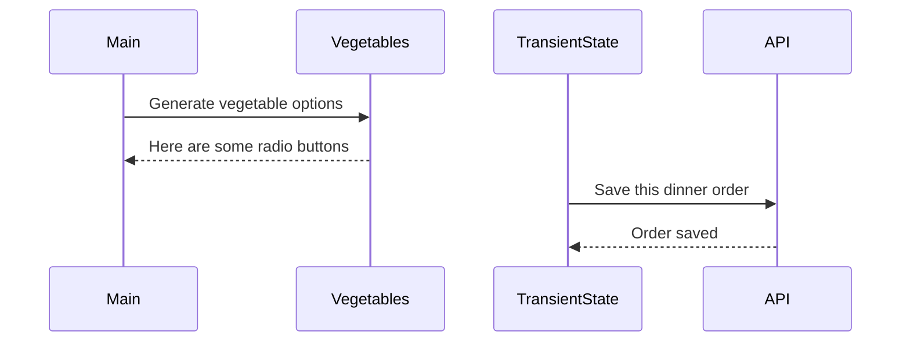

# Events and State Self-Assessment

> 🧨 Make sure you answer the vocabulary and understanding questions at the end of this document before notifying your coaches that you are done with the project

## Setup

1. Make sure you are in your `workspace` directory
1. `git clone {github repo SSH string}`
1. `cd` into the directory it creates
1. `code .` to open the project code
1. Use the `serve` command to start the web server
1. Open the URL provided in Chrome

## Requirements

### Initial Render

1. All 10 base dishes should be displayed as radio input options.
1. All 9 vegetables should be displayed as radio input options.
1. All 6 side dishes should be displayed as radio input options.
1. All previously purchases meals should be displayed below the meal options. Each purchase should display the primary key and the total cost of the purcahsed meal.

### State Management

1. When the user selects an item in any of the three columns, the choice should be stored as transient state.
1. When a user makes a choice for all three kinds of food, and then clicks the "Purchase Combo" button, a new sales object should be...
    1. Stored as permanent state in your local API.
    1. Represented as HTML below the **Monthly Sales** header in the following format **_exactly_**. Your output will not have zeroes, but the actual amount.
        ```html
        Receipt #1 = $00.00
        ```
   1. The user's choices should be cleared from transient state once the purchase is made.

## Design

Given the description and animation above...

1. Create an ERD for this application before you begin.
1. Make a list of what modules need to be created to make your application as modular as possible. Create a **Dependency Graph** for the project to be reviewed once you are complete with the assessment.
1. Create a **Sequence Diagram** that visualizes what your algorithm is for this project. We'll give you a minimal starting point.



## Vocabulary and Understanding

> 🧨 Before you click the "Assessment Complete" button on the Learning Platform, add your answers below for each question and make a commit. It is your option to request a face-to-face meeting with a coach for a vocabulary review.

1. Should transient state be represented in a database diagram? Why, or why not?

   > No transient state should not be represented because is it not permanent data. 
   what is in the database is data that is permanent instead of trasient. A user could make choices that would change transient data, but if they are never saved to the database and they would not show up in the database. They should be a part of sequence diagrams because they show should each step of the process of data going from transient to permanent. database diagrams should just show the permanent data that is in the database, and transient data is not permanent.

2. In the **FoodTruck** module, you are **await**ing the invocataion of all of the component functions _(e.g. sales, veggie options, etc.)_. Why must you use the `await` keyword there? Explain what happens if you remove it.

   > It would not wait for the component function to fully finish before recieving the data for the function. The function entree options for example has to run a fetch call and wait for that data to get back to it. If we don't use that await keyword for that function it is not fully waiting for everything in the function to be recieved and is not correctly displayed. If you remove it, it shows up as just an object promise on my page. That means it did not await for the promise to be converted to a javascript object as apart of that function. It has to await and make sure all of parts of the function get the correct data.

3. When the user is making choices by selecting radio buttons, explain how that data is retained so that the **Purchase Combo** button works correctly.

   > The radio button choices the user makes are retained in transient state which then converts to permanent state to the database when the Purchase Combo button is chosen. So first there is a transient state object defined that is to hold the ids and they should match the database id. They should be able to hold of all ids of the possible choices a user can make. Then the user creates a functions for each property to modify the transient state. We had three propertys therefore 3 functions for the property to modify the transient state. Then the user makes a function to convert the transient state into a permanent state. In this case we use the POST method because we want to take the transient state and save it to the orders in a permanent state. All of this is done in the TranisientState.js. Then in every module containing HTML for radio buttons we want to make a function that targets the radio button so that when the radio button is clicked, it stores the data Id of what was clicked exactly. Then we want to add a documentEventListener to listen for any change in what option of the radio button is clicked. We also want to put in our function that targets the exact radio button into the eventListener then we know what dataId the button is getting changed to exactly.
   Once we have that data, it can be passed into the POST method to add to the database.

4. You used the `map()` array method in the self assessment _(at least, you should have since it is a learning objective)_. Explain why that function is helpful as a replacement for a `for..of` loop.

   > The map() method creates a new way of looking at iteration for arrays and I believe strengthens your understanding of how iteration works. It really helped me understand the for..of loop better because now I have something to compare it to and I personally find map() a little easier to read. Learning how it creates a new array compared to a for..loop that doesn't is helpful to
   see what differences are in all of the methods for iterating.
